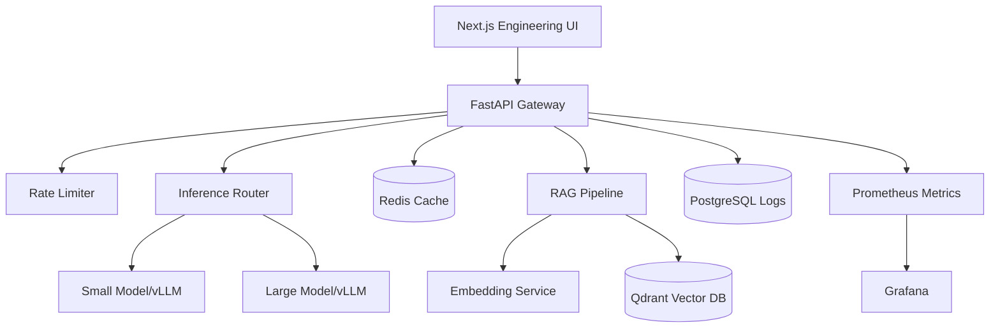

# Distributed LLM Inference + RAG Platform

Production-style ML systems reference platform for async inference serving, retrieval augmented generation, caching, routing, streaming, and observability.



## System overview

This repository is intentionally structured like an internal AI infrastructure tool rather than a toy chatbot. The backend is an async FastAPI gateway that coordinates request tracing, rate limiting, semantic retrieval, cache lookups, model routing, SSE token streaming, structured logs, and Prometheus instrumentation. The frontend is a dark-mode Next.js dashboard for chat, retrieval inspection, traces, routing decisions, metrics, and failure simulation.

## Request lifecycle

1. Client sends `/chat` or `/stream` with a query and optional RAG flag.
2. Middleware attaches a request id and records latency/active request metrics.
3. Rate limiter checks IP quota in Redis, falling back to in-memory counters if Redis is degraded.
4. Response cache checks exact prompt cache; retrieval cache checks reusable retrieval results.
5. RAG service chunks uploaded documents, embeds text, indexes vectors in Qdrant, and retrieves top-k chunks.
6. Router estimates query complexity and chooses small or large model with an explainable score.
7. Inference service calls a vLLM-compatible OpenAI endpoint when configured, otherwise uses deterministic local simulation for development.
8. SSE streaming emits lifecycle trace events, token events, and completion metrics.
9. Logs are written as structured JSON; Prometheus exports latency, throughput, token, cache, retrieval, routing, and streaming metrics.

## Technology choices and tradeoffs

- **FastAPI + asyncio**: simple async request model, excellent typed API ergonomics, and easy SSE support.
- **Redis**: fast response/retrieval cache and distributed rate limiter. The app degrades to local memory when Redis is unavailable.
- **Qdrant**: purpose-built vector search with payload filters and operationally simple Docker deployment.
- **PostgreSQL**: durable metadata and request audit log storage, separated from vector data.
- **vLLM-compatible client**: production deployments can point at OpenAI-compatible vLLM servers while local dev remains lightweight.
- **Prometheus/Grafana**: industry-standard pull metrics and dashboarding.
- **Next.js + Tailwind + Recharts**: typed dashboard with real-time-ish charts and engineering-focused UI.

## Scaling considerations

- Run multiple stateless FastAPI replicas behind Nginx; keep cache/rate-limit state in Redis.
- Split embedding and generation into independent worker pools with separate autoscaling policies.
- Use Qdrant sharding/replication for large corpora and isolate hot collections by tenant.
- Add request queues for GPU backpressure and admission control.
- Use streaming cancellation hooks to stop wasted generation when clients disconnect.
- Move request logs to partitioned Postgres tables or ClickHouse when volume grows.

## Bottlenecks

- GPU decode throughput dominates generation latency for long outputs.
- Embedding large PDFs can saturate CPU if chunking and PDF parsing are synchronous.
- Vector search p95 grows with collection size without payload filters and index tuning.
- Redis cache hit ratio strongly impacts perceived latency for repeated operational queries.

## Benchmark examples

Local simulated mode on a laptop is designed to validate system behavior, not GPU throughput:

| Scenario | Expected behavior |
| --- | --- |
| cached simple query | sub-100ms response after warm cache |
| uncached RAG query | retrieval latency visible in trace panel |
| complex query | routed to large model with higher confidence |
| Redis failure simulation | degraded local cache/rate limit mode |
| model timeout simulation | fallback response path and trace event |

## Local deployment

```bash
cp backend/.env.example backend/.env
docker compose up --build
```

Services:

- Frontend: http://localhost:3000
- API: http://localhost:8000
- API docs: http://localhost:8000/docs
- Prometheus: http://localhost:9090
- Grafana: http://localhost:3001 (admin/admin)
- Qdrant: http://localhost:6333/dashboard

## API endpoints

- `POST /chat` non-streaming RAG chat
- `GET /stream?message=...` SSE token stream
- `POST /upload` PDF/text document ingestion
- `POST /retrieve` semantic retrieval inspection
- `GET /routing-debug?message=...` router explanation
- `POST /simulate/{failure}` enable failure modes (`model_crash`, `redis_failure`, `timeout`, `clear`)
- `GET /health` dependency health and degraded modes
- `GET /metrics` Prometheus scrape endpoint

## Future improvements

- Add cross-encoder reranking and hybrid BM25/vector retrieval.
- Add tenant-aware auth, quotas, and data isolation.
- Add GPU-aware router using live queue depth, KV-cache pressure, and cost budgets.
- Add OpenTelemetry traces and exemplars linking Grafana panels to request ids.
- Add continuous evals for retrieval quality and hallucination detection.
